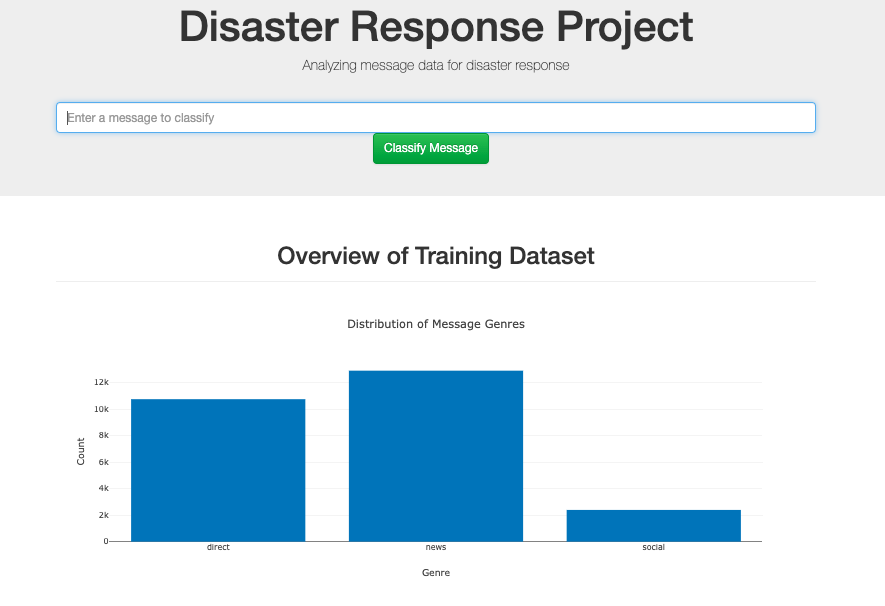
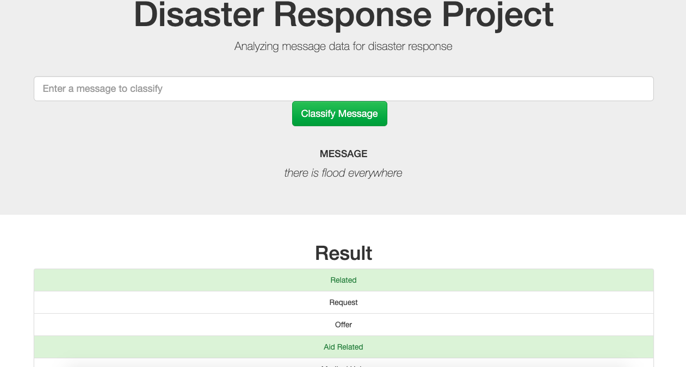

# Disaster Response Pipeline Project

### File struncture :

```
- app
| - template
| |- master.html  # main page of web app
| |- go.html      # classification result page of web app
|- run.py         # Flask application file

- data
|- disaster_categories.csv  # categories data
|- disaster_messages.csv    # message data
|- process_data.py          # pre-process script
|- DisasterResponse.db      # database to save clean data to

- models
|- train_classifier.py     # training script
|- disaster_model.pkl      # saved model file

- notebooks
|- ETL Pipeline Preparation.ipynb  # etl exploration
|- ML Pipeline Preparation.ipynb   # ML exploration

- README.md
```

---

### Required packages:

- flask
- joblib
- jupyter
- pandas
- plot.ly
- numpy
- scikit-learn
- sqlalchemy


---

### Instructions:
1. Run the following commands in the project's root directory to set up your database and model.

    - To run ETL pipeline that cleans data and stores in database
        `python data/process_data.py data/disaster_messages.csv data/disaster_categories.csv data/DisasterResponse.db`
    - To run ML pipeline that trains classifier and saves
        `python models/train_classifier.py data/DisasterResponse.db models/classifier.pkl`

2. Run the following command in the app's directory to run your web app.
    `python run.py`

3. Go to http://0.0.0.0:3001/


### Output :

#### Training example distribution visualisation : 

---




---


#### Classify any tweets : 

---



---

### Future improvements :

* We can achieve good accuracy by using the algorithm like LSTM with word embedding.
* Better pre-processing techniques can be used.


